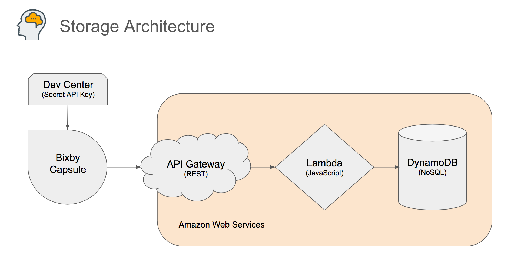

# My Brain Capsule

## Summary

Organization and capsule name in Bixby: van.memory

This capsule helps people remember things. It remembers anything you tell it, and helps you recall it later. Say where you put something, when you did something, or anything else you can describe.

## Detailed Description

Say something, and this skill will remember it. Ask a question, and you'll hear back the most recent thing you said about it. It recognizes questions when you include a question word, such as who, when, or where. It repeats back the last thing you said that has similar words in it, searching all memories for the words in your question.

Always tells you the most recent thing you said about a topic. So if you need to change something, simply add a new memory, and the new one takes priority.

Helps you manage a growing list of memories and can respond to certain questions or commands, such as:
How many memories are there?
What was the last thing I said?
List all memories.
Forget the last thing I said.
Or, forget all memories.

Will ask for confirmation before deleting all memories.

Your memories are private, but only within your household. Anyone else talking to this skill from your location
will be able to hear these memories, so keep that in mind.

Icon designed by vecteezy.com

Hope this makes your life more convenient in some way!

## Sample utterances

* ask My Brain to remember that my mother's birthday is January 22nd
* ask My Brain what is my mother's birthday
* tell My Brain that my mother is expecting a picnic on April fourth
* ask My Brain when is my mother expecting a picnic

## Category and Keywords

Organizers & Assistants

Keywords: note, memory, remember, recall

See the [privacy policy](privacy-policy.txt) and [terms-of-service](terms-of-service.txt) for more information.

## Contributing
 
This repo contains the code that runs in Bixby. The Dev Center, API Gateway, and Dynamo DB don't have any code of their own, but they need configuration (TODO: add details about how to configure these).

The AWS lambda accesses the DynamoDB for storing and retrieving memories, that code is in the [brain-lambda](https://github.com/vboughner/brain-lambda) repo.

## Demo Slide and Storage Architecture

