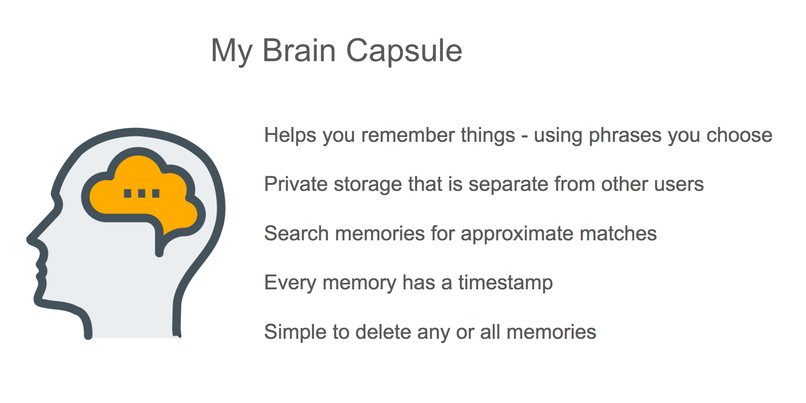

# Bixby Capsule code for My Brain

This is half of an active Bixby Capsule in the marketplace, called "My Brain". This repo contains the Bixby capsule
code. The AWS Lambda code stored in the [brain-lambda](https://github.com/vboughner/brain-lambda) repo.

## Summary

This capsule helps people remember things. It remembers anything you tell it, and helps you recall it later.
Say where you put something, when you did something, or anything else you can describe.

## Tutorial

Have a look at the [Bixby Capsule with AWS Tutorial](https://github.com/vboughner/bixby-capsule-with-aws)
for details about how to configure AWS to make a capsule work like this one. That repository includes
everything you need, and copious instructions.

This repository is under active development and may not reflect the easiest way to do everything, yet.

## Demo Slide

## Details

My Brain capsule recognizes questions when you include a question word, such as who, when, or where.
My Brain capsule repeats back the last thing you said that has similar words in it, searching all
memories for the words in your question.

It always tells you the most recent thing you said about a topic. So if you need to change something,
simply add a new memory, and the new one takes priority.

Helps you manage a growing list of memories and can respond to certain questions or commands, such as:
- How many memories are there?
- What was the last thing I said?
- List all memories
- Forget the last thing I said
- Forget all memories

It will ask for confirmation before deleting all memories.

Icon design came from vecteezy.com

See the [privacy policy](privacy-policy.txt) and [terms-of-service](terms-of-service.txt) for more information.

This repo contains the code that runs in Bixby. The Bixby Developer Center, API Gateway, and Dynamo DB
don't have any code of their own here, but they need configuration. The tutorial above gives you a
pretty good idea of how to do it.

## Storage Architecture

## Running this Capsule

If you'd like to try out this capsule, without providing your own backend storage, you may utilize the test
configuration in the cloud, and experiment with this capsule using Bixby Developer Studio. There is no
guarantee the cloud we use for testing will be running, or that it will persist your memories for
any length of time.

Here's how to try it out yourself:
- clone this GitHub repository to a local directory with `git clone https://github.com/vboughner/van.memory.git` 
- download, install, and run [Bixby Developer Studio](https://bixbydevelopers.com)
- open this capsule in Studio using the folder you cloned (use `File->Open Capsule` from the top-level menu)

If you decide you'd like to make a capsule based on this work, have a look at the
[tutorial](https://github.com/vboughner/bixby-capsule-with-aws) mentioned above,
as it contains step-by-step instructions on how to set up your own backend services.
You cannot rely on the test configuration, as it gets cleaned out and/or updated often.
